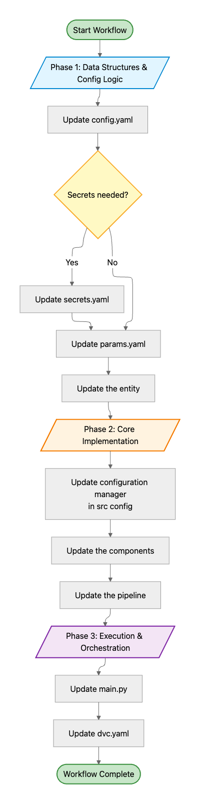

# Advanced Imaging Techniques for Lung Cancer Diagnosis 

## 📋 Project Overview
Computed tomography (CT) scans are widely used to diagnose lung conditions due to their ability to provide a detailed overview of the body's respiratory system. This repo contain End to End ML-based classification of CT scan images


**Adenocarcinoma**
- **Origin:** Glandular cells that produce mucus, often in the outer parts of the lungs.
- **Associated with:** Most common type in smokers and non-smokers, more frequent in women and younger people.
- **Treatment:** May have targetable gene mutations (like EGFR, ALK) for targeted therapies.

**Squamous Cell Carcinoma**
- **Origin:** Flat, scale-like squamous cells lining the airways (bronchi).
- **Associated with:** Strongly linked to a smoking history, typically found centrally.
- **Treatment:** Less likely to have common adenocarcinoma mutations; may respond to immunotherapy.

**Large Cell Carcinoma**
- **Origin:** Can develop anywhere in the lungs from various cells, appearing "large" under a microscope.
- **Associated with:** Tends to grow and spread quickly.
- **Treatment:** Often diagnosed when cells are too undifferentiated (undeveloped) for specific classification, requiring broader NSCLC treatments.

---
## 🔧 Key Components

```

📁 config/ → YAML config for models, prompts, logging
📁 data/ → Raw and processed data
📁 docs/ → Content,Images 
📁 examples/ → Minimal scripts to test key features
📁 models/ → Saved models
📁 notebooks/ → Quick experiments and prototyping
📁 templates/ → UI template
📁 tests/ → Unit, integration, and end-to-end tests

📁 src/ → The core engine — all logic lives here:
├── components/ → Data loading and preprocessing
├── config/ → Model training
├── constants/ → Constants 
├── entity/ → Extra abilities: web search, code execution
├── handlers/ → Input/output processing and error management
├── models/ → Model training
├── pipelines/ → Pipeline stages
└── utils/ → Logging, caching, rate limiting,saving files
📄 requirements.txt
```
---
## 👩‍💻 Workflow



## ⚡ Best Practices

- Track prompt versions and results  
- Separate configs using YAML files  
- Structure code by clear module boundaries  
- Cache responses to reduce latency and cost  
- Handle errors with custom exceptions  
- Use notebooks for rapid testing and iteration  
- Monitor API usage and set rate limits  
- Keep code and docs in sync  

---

## 🧭 Getting Started

1. **Clone the repository**
   ```bash
   $ git clone <repo-url>
   $ cd project_dir
   ```
2. **Create and activate virtual environment** 

   ```bash
   $ python3 -m venv dvc-venv
   $ echo "export PYTHONPATH=$PWD" >> dvc-venv/bin/activate
   $ source dvc-venv/bin/activate
   ```
   Using Conda :
   ```bash
   $ conda create -n dvc-venv python=3.12 -y
   $ conda dvc-venv activate
   ```

3. **Install dependencies**
   ```bash
   $ pip install --upgrade pip setuptools wheel
   $ pip install -r requirements.txt
   ```
   For MacOs
   ```bash
   $ pip install tensorflow tensorflow-macos tensorflow-metal
   $ pip install torch torchvision torchaudio
   $ pip install jax-metal ml_dtypes==0.2.0 jax==0.4.26 jaxlib==0.4.26

   ``` 

   Add Virtual Environment to Jupyter Notebook

   ```bash
   $ python -m ipykernel install --user --name=dvc-venv
   ``` 

   Configure ToC for jupyter notebook (optional)

   ```bash
   $ jupyter contrib nbextension install --user
   $ jupyter nbextension enable toc2/main
   $ jupyter notebook #run notebook
   ```

4. **Install DVC**
   ```sh
   $ pip install dvc
   ```

5. **Initialize DVC (if not already initialized)**
   ```sh
   $ dvc init
   ```

6. **Add your data**
   Place your raw data in the `data/` directory and track it with DVC:
   ```sh
   $ dvc add data/<your-data-file>
   $ git add data/<your-data-file>.dvc .gitignore
   $ git commit -m "Add raw data"
   ```

7. **Run the pipeline**
   Use scripts in `src/` to preprocess data, train models, and generate reports. You can organize pipeline stages using DVC.

8. **Jupyter Notebooks**
   Store exploratory analysis and experiments in the `notebooks/` directory.
---


## 📁 Core Files

- `requirements.txt` – Package dependencies  
- `README.md` – Project overview and usage  
- `Dockerfile` – Container build instructions  

## Reproducibility

- Use DVC to version datasets and models.
- Track experiments and results in `reports/`.

## 💡 Development Tips

- Use modular structure  
- Test components early  
- Track with version control  
- Keep datasets fresh  
- Monitor API usage 


<!-- END -->
<!-- --- -->
