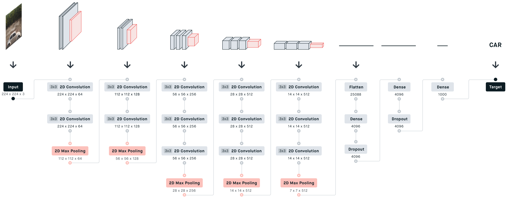
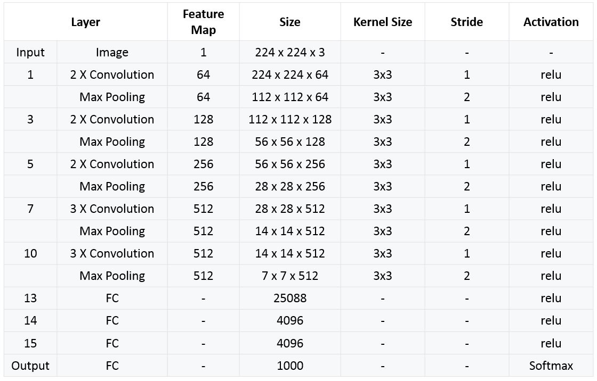

# VGGNet-16 Architecture
[Read about CNN ](https://towardsdatascience.com/convolutional-neural-networks-explained-9cc5188c4939/)

The full name of VGG is the Visual Geometry Group, which belongs to the Department of Science and Engineering of Oxford University. It has released a series of convolutional network models beginning with VGG, which can be applied to face recognition and image classification, from VGG16 to VGG19.The original purpose of VGG's research on the depth of convolutional networks is to understand how the depth of convolutional networks affects the accuracy of large-scale image classification and recognition  -Deep-16 CNN, in order to deepen the number of network layers and to avoid too many parameters, a small 3x3 convolution kernel is used in all layers.



## What is VGG16
A convolutional neural network is also known as a ConvNet, which is a kind of artificial neural network. A convolutional neural network has an input layer, an output layer, and various hidden layers. The VGG-16 model is a convolutional neural network (CNN) architecture that was proposed by the Visual Geometry Group (VGG) at the University of Oxford. It is characterized by its depth, consisting of 16 layers including 13 convolutional layers and 3 fully connected layers. The creators of this model evaluated the networks and increased the depth using an architecture with very small (3 × 3) convolution filters, which showed a significant improvement on the prior-art configurations. They pushed the depth to 16–19 weight layers making it approx — 138 trainable parameters
 - VGG16 used for object detection and classification algorithm

## The network structure 
- VGG16 takes input tensor size as 224, 244 with 3 RGB channel
.The average RGB value is calculated for all images on the training set image, and then the image is input as an input to the VGG convolution network.
- Most unique thing about VGG16 is that instead of having a large number of hyper-parameters they focused on having convolution layers of 3x3 filter with stride 1 and always used the same padding and maxpool layer of 2x2 filter of stride 2.The convolution and max pool layers are consistently arranged throughout the whole architecture
- The minimum VGG11 has 8 convolutional layers and 3 fully connected layers. The maximum VGG19 has 16 convolutional layers. +3 fully connected layers. In addition, the VGG network is not followed by a pooling layer behind each convolutional layer, or a total of 5 pooling layers distributed under different convolutional layers. 
- Three Fully-Connected (FC) layers follow a stack of convolutional layers: the first two have 4096 channels each, the third performs 1000-way ILSVRC classification and thus contains 1000 channels (one for each class). The final layer is the soft-max layer.

💡 Note :-  The 16 in VGG16 refers to 16 layers that have weights. In VGG16 there are thirteen convolutional layers, five Max Pooling layers, and three Dense layers which sum up to 21 layers but it has only sixteen weight layers i.e., learnable parameters layer.


- Each convolutional layer in AlexNet contains only one convolution, and the size of the convolution kernel is 7 7 ,. In VGGNet, each convolution layer contains 2 to 4 convolution operations. The size of the convolution kernel is 3 3, the convolution step size is 1, the pooling kernel is 2 * 2, and the step size is 2. The most obvious improvement of VGGNet is to reduce the size of the convolution kernel and increase the number of convolution layers.


## Training

- The optimization method is a stochastic gradient descent SGD + momentum (0.9) with momentum. The batch size is 256.

- Regularization : L2 regularization is used, and the weight decay is 5e-4. Dropout is after the first two fully connected layers, p = 0.5.

- Although it is deeper and has more parameters than the AlexNet network, we speculate that VGGNet can converge in less cycles for two reasons: one, the greater depth and smaller convolutions bring implicit regularization ; Second, some layers of pre-training.

- Parameter initialization : For a shallow A network, parameters are randomly initialized, the weight w is sampled from N (0, 0.01), and the bias is initialized to 0. Then, for deeper networks, first the first four convolutional layers and three fully connected layers are initialized with the parameters of the A network. However, it was later discovered that it is also possible to directly initialize it without using pre-trained parameters.

- In order to obtain a 224 * 224 input image, each rescaled image is randomly cropped in each SGD iteration. In order to enhance the data set, the cropped image is also randomly flipped horizontally and RGB color shifted.

## Transfer Learning with VGG16 and Keras
- Transfer learning involves using the patterns a neural network has discovered to classify images for a specific problem to classify a completely different problem without retraining that part of the network.
- Extract features with Keras VGG16 :
   ```bash
    import keras
    from keras.applications.vgg16 import VGG16
    from keras.applications.vgg16 import preprocess_input
    import numpy as np

    model = VGG16(weights='imagenet', include_top=False)

    img_path = 'elephant.jpg'
    img = keras.utils.load_img(img_path, target_size=(224, 224))
    x = keras.utils.img_to_array(img)
    x = np.expand_dims(x, axis=0)
    x = preprocess_input(x)

    features = model.predict(x)
   ```
 💡 Note :- use _Includetop=False to remove the classification layer that was trained on the ImageNet dataset and set the model as not trainable. Also, we used the preprocess_input function from VGG16 to normalize the input data.


## Some basic FAQs
    Q1: Why can 3 3x3 convolutions replace 7x7 convolutions?

    **Answer 1**: 
    3 3x3 convolutions, using 3 non-linear activation functions, increasing non-linear expression capabilities, making the segmentation plane more separable Reduce the number of parameters. For the convolution kernel of C channels, 7x7 contains parameters , and the number of 3 3x3 parameters is greatly reduced.

    Q2: The role of 1x1 convolution kernel

    **Answer 2** : 
    Increase the nonlinearity of the model without affecting the receptive field 1x1 winding machine is equivalent to linear transformation, and the non-linear activation function plays a non-linear role

## Resources 
 1. [Accelerating Very Deep Convolutional
Networks for Classification and Detection](https://arxiv.org/pdf/1505.06798)
